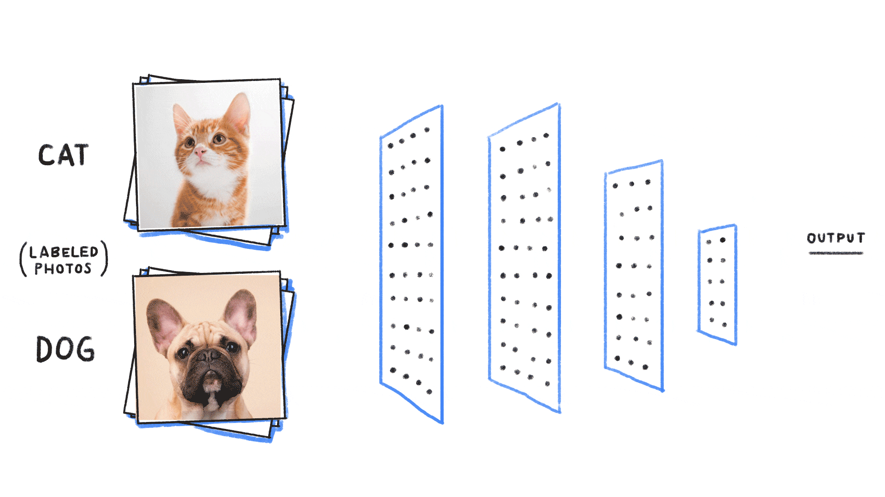
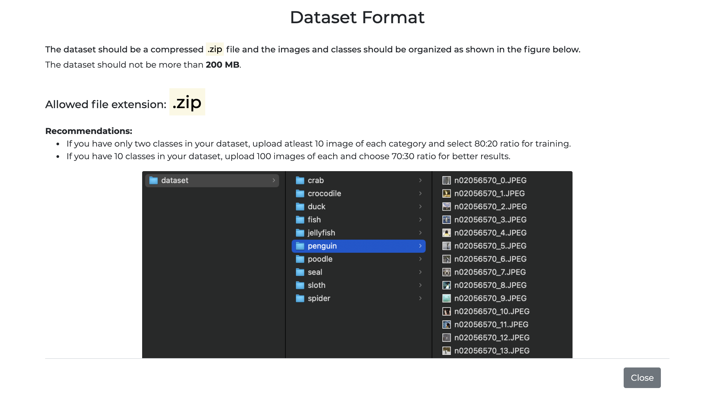
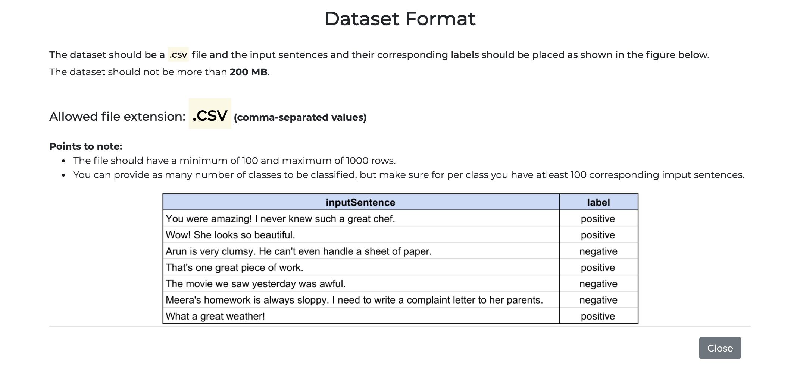
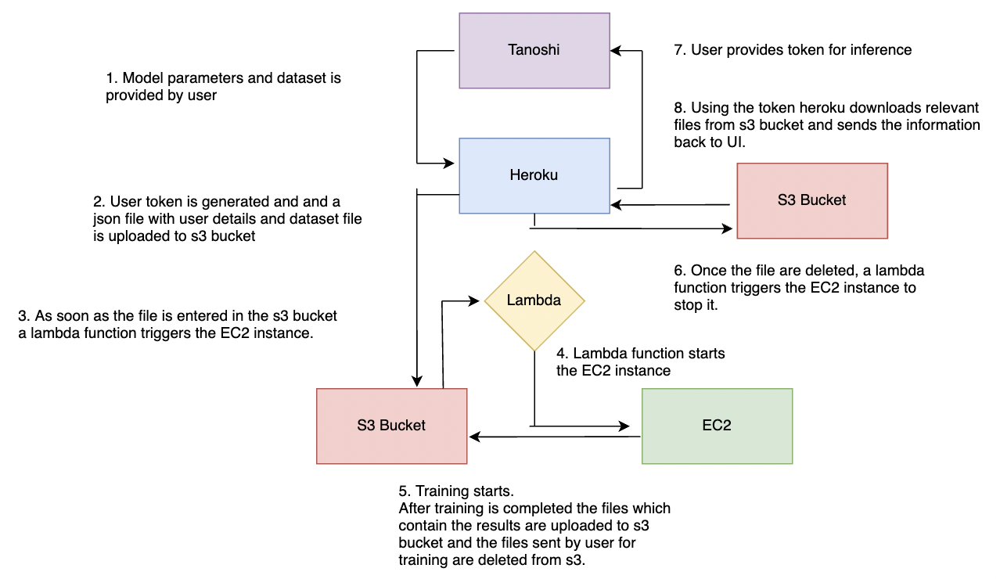

  
  <h1 class="custom-inline">Tanoshi</h1>

This is an end-to-end platform where you can upload your own custom dataset, set model parameters and train your own deep learning model without writing any line of code.

Tanoshi currently provides Image classification and Sentiment Analysis machine learning models.
It has a feature to create a custom model by setting model parameters such as:

- Batch size
- Optimizer
- Learning rate
- Number of epochs
- Training-Validation ratio

After validating the model parameters an input dataset file a user token is created and training starts, which takes around five-ten minutes. Once training is completed the user can use that token to test their model.

## Image Classification

In this process an algorithm takes an image as input and tells you what is there in that image, much like what is shown below.

  

It provides two models **Resnet34** and **MobileNetV2** which are pretrained on Imagenet dataset you can use either of them. Create a custom dataset which follows the below mentioned description and you can start training.

  

## Sentiment Analysis

  

You can create a custom dataset and train using either **LSTM** or **GRU** from scratch. Allowed dataset format is shown below.

  

## Code Structure

There are three major components of this project:

- Heroku
- EC2 instance
- AWS Lambda

  

You can go to the above links to know more about this project in detail.
